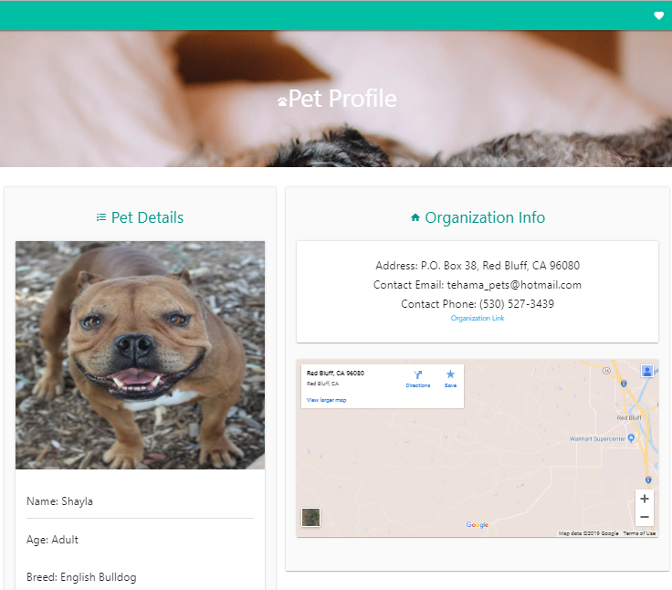

# Purr-fect-Match

<h1 align="center">
  
</h1>

<h3>A Full-stack Web Application for finding pets to foster/adopt</h3>

[Link to Deployed Application](https://purr-fect-match.herokuapp.com/)

# Description
`Purr-fect Match` is a pet adoption service. We strive to help you find the an animal in need of a family for you to find information, find contact info and eventually adopt.

### Functionality
This is a full-stack web-based application built upon the `Node.js` environment, heavily relying on `Express` for functionality and leverages third-party APIs used for populating our site's content as well as for authentication.

### User Authentication
`Purr-fect Match` also utilizes user authentication through `Okta` and saves those users' unique IDs in a cloud database so that the user can log in and bookmark/favorite animals that they are interested in to follow up on at a later time.

### Front-end
The front-end is built with the `Materialize` CSS framework and utilizes `Handlebars` for templating elements of our application for continuous reuse, reducing the amount of hardcoding needed for all of the different pages and views within the application flow.

# How It Works
<h1 align="center">
  
</h1>

## Features

### Okta Authentication - User Model
* Login/Authenticate through Google/Okta
* Store unique id from returned token in database
* Store unique id into local cookies (routing/paths)

### Results - PetFinder API
* Search for pet inputting filters:
    * Type of pet
    * Breed 
    * Gender
    * Age 
    * Size 
    * Coat
    * Location
* Users also have the option to select multiple choices for each category and they also have the option to select nothing, which will bring back all results
* Input our filter data into API 
* Take results and put them into cards on results page
* Each pet result card links to a pop up Modal with with brief details, a favorites button, and a link to their pet profile page

### Favorites Model - Handlebars
* A user can favorite any animal they want and as many animals as they want
* Get the favorites from the database with `findAll()` method
* The call to the petfinder API gives us a promise
* The user can click the heart in the top right corner to view all of their saved favorited pets
* Use of handlebars to generate the favorites page
* On the favorites page, the user can delete favorites from their saved favorites. 
* They also have the option to go to each pet profile page 

### Pet Profile - PetFinder API
* Each pet profile page is dynamiclally generated using their Pet ID as a unique identifier
* The call to the petfinder API gives us a response for each pet ID
* Append the data response to the page for the following information:                      
    * Photo
    * Description
    * Organization contact information (if not null) such as: Address, email, phone, URL link, and a map of their location

### Organization Map - Google Maps Embed API
* Dynamically displays a map to the organization address on the pet profile page
* The call to the petfinder API gives us a response for each pet ID including organization address
* For instances with P.O. boxes, "P.O." is removed and the map locates to that area

# Results Page
<h2 align="center">

</h2>

# Pet Profile Page
<h2 align="center">

</h2>

## Technologies Used

* HTML
* CSS3
    * Materialize
* JavaScript
* jQuery
* Handlebars (HTML templating engine)
* Node.js
    * AJAX (handles API requests)
    * Sequelize (open-source ORM)
    * Express (MVC application framework)
    * MySQL (database)
    * JawsDB (Heroku cloud database)
* API Integration
    * Okta Authentication API
    * Petfinder API
    * Google Maps API

    

## APIs
* [Okta Authentification API](https://developer.okta.com/docs/reference/api/authn/)
* [Petfinder API](https://www.petfinder.com/developers/v2/docs/#get-animal-types)
* [Google Maps API](https://developers.google.com/maps/documentation/javascript/tutorial)

