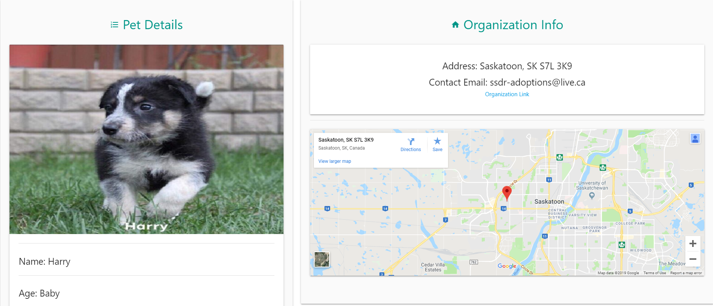

# Purr-fect-Match
[Link to Deployed Application](https://purr-fect-match.herokuapp.com/)

`Purr-fect Match` is a pet adoption service. We strive to help you find the an animal in need of a family for you to find information, find contact info and eventually adopt.

This is a full-stack web-based application built upon the `Node.js` environment, heavily relying on `Express` for functionality and leverages third-party APIs used for populating our site's content as well as for authentication.

`Purr-fect Match` also utilizes user authentication through `Okta` and saves those users' unique IDs in a cloud database so that the user can log in and bookmark/favorite animals that they are interested in to follow up on at a later time.

The front-end is built with the `Materialize` CSS framework and utilizes `Handlebars` for templating elements of our application for continuous reuse, reducing the amount of hardcoding needed for all of the different pages and views within the application flow.

## Used technologies

TBD

## APIs
* [Okta Authentification API](https://developer.okta.com/docs/reference/api/authn/)
* [Petfinder API](https://www.petfinder.com/developers/v2/docs/#get-animal-types)
* [Google Maps API](https://developers.google.com/maps/documentation/javascript/tutorial)

